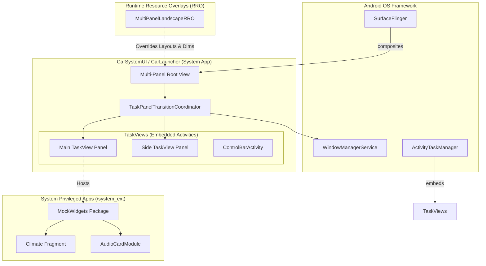

# Scalable UI - Android System Architecture

This document details the internal Android Automotive OS (AAOS) component architecture that powers the "Fluidic Precision" Scalable UI. It focuses on how the SystemUI, CarLauncher, and window management layers were modified to support a dynamic, multi-panel drag-and-drop interface.

## 1. System Architecture Diagram

The Scalable UI modifies the core Android UI rendering pipeline. Instead of a single static application window, the system manages multiple concurrent `TaskView` surfaces controlled by a custom transition coordinator.



---

## 2. Component Deep Dive

### A. `MultiPanelLandscapeRRO` (Runtime Resource Overlay)
The cornerstone of the visual changes is the `MultiPanelLandscapeRRO`. Instead of forking the entire AOSP CarSystemUI repository, we use this overlay to dynamically inject the "Fluidic Precision" aesthetics.

- **Layout Overrides:** Overrides standard AAOS layouts (e.g., `car_launcher_multi_window.xml`) to divide the screen into a Main Panel (e.g., 70% width) and a Sidebar Panel (30% width).
- **Glassmorphism Tokens:** Injects custom dimension arrays, corner radiuses (`@dimen/panel_corner_radius`), and translucent color states (`@color/glass_background`) directly into the SystemUI resource pool.
- **Dynamic State:** The overlay is set as `isStatic="false"` in its `AndroidManifest.xml`, allowing it to be toggled on/off via the `deploy_ui.sh` script without requiring a device wipe or affecting standard build targets.

### B. `TaskPanelTransitionCoordinator`
This is the custom orchestration engine responsible for the dynamic drag-and-drop functionality between the panels.

- **Touch Interception:** It acts as a gesture listener on the boundaries of the `TaskView` panels. When a user holds and drags the top bar of a widget, the coordinator calculates the touch delta.
- **Geometry Animation:** Upon release, it uses `ValueAnimator` to visually morph the bounds of the source `TaskView` into the destination bounds.
- **Activity Reparenting:** Once the animation concludes, it communicates with the `ActivityTaskManager` (via WindowManager API) to officially reparent the activity's `WindowToken` from the Sidebar's `TaskView` into the Main Panel's `TaskView`.

### C. `ControlBarActivity` & `AudioCardModule`
The persistent bottom and side controls were modified to integrate directly with native AOSP media and radio.
- **`AudioCardModule`:** Restored to natively bind to the active `MediaBrowserService` (e.g., Spotify or the native Radio app), rendering track info and playback controls persistently across all panel transitions.
- **`ControlBarActivity`:** The HVAC and System Nav bar. It intercepts climate events and broadcasts them to the VHAL.

### D. `MockWidgets` (Privileged Modules)
A suite of modular app fragments that populate the `TaskView` panels.
- **Location:** Installed to `/system_ext/priv-app/MockWidgets`.
- **Privileged Access:** Contains widgets for Smart Home, Agenda, and Climate. 
- **Security:** Because it requires `android.car.permission.CONTROL_CAR_CLIMATE`, it is accompanied by a strictly generated `privapp-permissions-mockwidgets.xml` allowlist file in `/system_ext/etc/permissions/`, allowing the `SystemServer` to grant it deep HAL access without crashing the OS.

---

## 3. Developing the MultiPanelLandscapeRRO

To achieve the Scalable UI aesthetics without causing destructive forks of the core AOSP `CarSystemUI`, we developed the `MultiPanelLandscapeRRO` using the Android Runtime Resource Overlay (RRO) framework.

Here is the step-by-step methodology used to develop the RRO for this system:

### Step 1: Defining the Overlay Target
An RRO is essentially a dummy APK containing only resources. In the `AndroidManifest.xml` of the RRO, we target the system UI:
```xml
<manifest package="com.android.systemui.multipanellandscaperro">
    <overlay targetPackage="com.android.systemui"
             priority="100"
             isStatic="false" />
</manifest>
```
*Note: Setting `isStatic="false"` was crucial. It allows us to enable/disable the overlay via the command line (`cmd overlay enable`) during demos, preventing it from permanently modifying every single Cuttlefish emulator on the build server.*

### Step 2: Overriding the Layout Structure
We created a `res/layout/` directory mirroring the `CarSystemUI` source. 
By overriding `car_launcher_multi_window.xml`, we restructured the static grid into the Scalable UI dual-panel configuration. We mapped the `MainPanel` to consume `70%` width, leaving `30%` for the interactive `SidePanel`.

### Step 3: Injecting Glassmorphism Design Tokens
Rather than hardcoding colors in the Kotlin files, we overrode the resource values.
- **Dimensions (`res/values/dimens.xml`):** Increased `@dimen/panel_corner_radius` for aggressive rounding.
- **Colors (`res/values/colors.xml`):** Injected translucent HEX values (e.g., `#66000000`) mapped to the `@color/glass_background` attributes to allow the underlying live wallpaper to bleed through the `TaskViews`.

### Step 4: Soong Build Configuration (`Android.bp`)
To ensure the Android build system correctly compiles and signs the overlay, we used the `runtime_resource_overlay` Soong module.
```bp
runtime_resource_overlay {
    name: "MultiPanelLandscapeRRO",
    theme: "MultiPanelLandscapeRRO",
    certificate: "platform",
    product_specific: true,
}
```
*Note: `certificate: "platform"` is mandatory because SystemUI is a platform-signed package. The RRO must share the same signature hierarchy to inject layouts.*

### Step 5: Activation and Debugging
After compilation, the RRO is placed in `/product/overlay/`. 
To activate it for the Scalable UI demo without rebooting, the `deploy_ui.sh` script executes:
```bash
adb shell cmd overlay enable --user 10 com.android.systemui.multipanellandscaperro
```
We verified the successful hook by dumping the resource manager state: `adb shell dumpsys overlay`.

---

## 4. Modification Summary Checklist

| Component | Path / Location | Modification | Purpose |
| :--- | :--- | :--- | :--- |
| **SystemUI Build Config** | `packages/apps/Car/SystemUI/samples/systemui_sample_rros.mk` | Removed `DewdDynamicAospRRO` | Prevented legacy overlay conflicts that broke panel geometry. |
| **Overlay Manifest** | `vendor/aospstack/ScalableUI/MultiPanelLandscapeRRO/AndroidManifest.xml` | Set `isStatic="false"` | Allowed dynamic toggling of the new UI without forcing it on all builds. |
| **Widget Permissions** | `vendor/aospstack/ScalableUI/MockWidgets/Android.bp` | Added `required: ["privapp-permissions-mockwidgets.xml"]` | Fixed a fatal `SystemServer` boot-loop by properly linking the privileged allowlist. |
| **Deployment Script** | `/home/hemang/deploy_ui.sh` | Added `cmd overlay enable` commands | Automates the activation of the `MultiPanelLandscapeRRO` at runtime. |
| **System Ext Permissions** | `/system_ext/etc/permissions/privapp-permissions-mockwidgets.xml` | Pushed via root ADB | Granted `CONTROL_CAR_CLIMATE` to the widget suite. |
