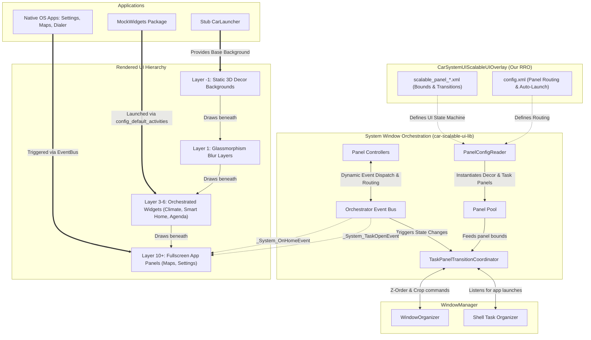
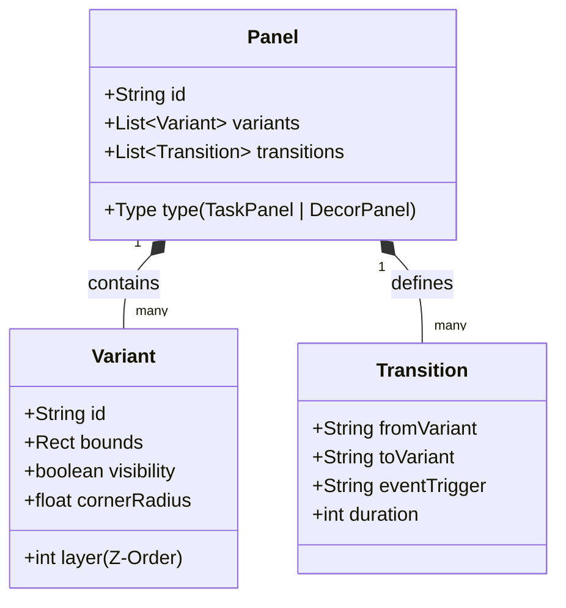
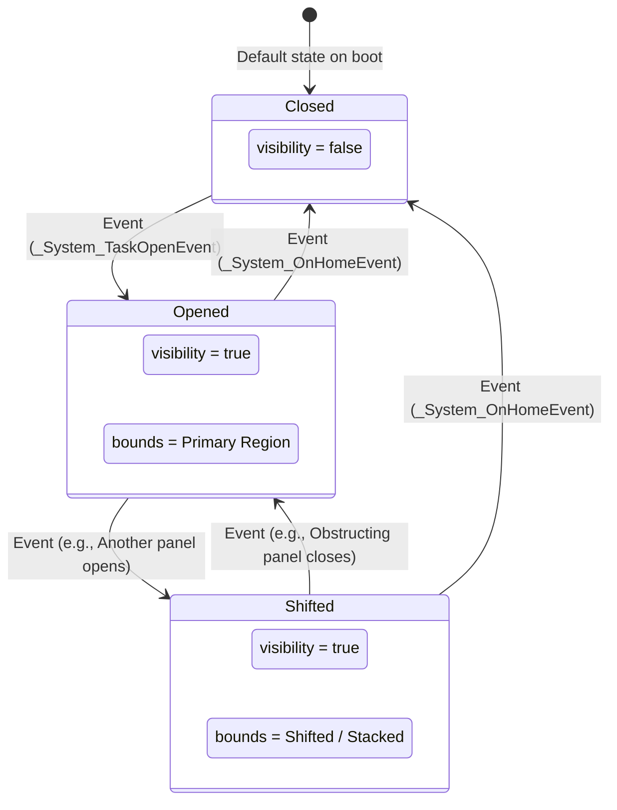

# Fluidic Precision: Scalable UI Architecture for Android Automotive OS

This repository contains the architecture definitions and Runtime Resource Overlay (RRO) for deploying the next-generation **"Fluidic Precision"** Glassmorphism UI on top of Android Automotive OS (AAOS) via **System Window Orchestration**.

## Core Architectural Shift

Traditionally, AAOS applications relied on **UI Embedding** using `ActivityView` and `TaskView` directly inside the `CarLauncher` Java codebase. This method was tightly coupled, memory-heavy, and prone to Z-ordering conflicts because every widget ran an isolated Android window hierarchy within another process.

This architecture transitions completely to **System Window Orchestration** using the AOSP `car-scalableui-lib`. Instead of embedding tasks, the framework delegates the spatial bounding, Z-ordering, and state transitions of actual Android Tasks directly to the WindowManager via an XML-driven state machine. This dramatically improves performance, decouples the Launcher from the application layout entirely, and enables multi-display orchestration.

## Detailed Architecture & Data Flow

The following diagram details how the AOSP WindowManager Shell interacts with the System Window Orchestrator, and how our custom RRO and code-level controllers drive spatial orchestration for both native apps and our custom `MockWidgets` suite.



## The XML Declarative Model

Scalable UI abstracts custom windowing logic into a high-level, config-driven XML model composed of the following core building blocks:



* **Panels**: The fundamental rectangular containers. 
  * `TaskPanel`: Hosts actual application tasks running in separate processes (e.g., Settings, Maps, MockWidgets).
  * `DecorPanel`: Hosts view-based layouts (e.g., UI shadows, static overlays) running in the System UI process for lower overhead.
* **Variants**: Define specific visual states (bounds, visibility, Z-order layers, alpha, corner radius) for each panel.
* **Transitions**: Define animation paths (duration, interpolators) to move a panel between variants triggered by an Event.

### Panel Transition Lifecycle & State Machine



---

## Fluidic Precision UI & MockWidgets Integration

With the latest architectural updates, the traditional `CarLauncher` is treated as a **Stub**. All complex widgets have been decoupled into the standalone **`MockWidgets`** package.

### Decoupled Widget Micro-Apps
Instead of monolithic fragments inside the Launcher, each widget is its own standard Android Activity:
* `MockMediaActivity` (Radio / Media Player)
* `AgendaActivity` (Calendar / Schedule)
* `ClimateActivity` (HVAC Control)
* `SmartDeviceActivity` (Smart Home Controls)
* `TimeWidgetActivity` (Clock / Weather)
* *(Note: `DrivingStatsActivity` was decommissioned in Model S-16 updates to maximize UI real estate.)*

### Auto-Launch Orchestration
These independent apps are seamlessly embedded into the UI grid at boot via SystemUI's `config.xml`:
```xml
<string-array name="config_default_activities" translatable="false">
    <item>media_panel;com.android.car.mockwidgets/com.android.car.mockwidgets.MockMediaActivity</item>
    <item>smart_home;com.android.car.mockwidgets/com.android.car.mockwidgets.SmartDeviceActivity</item>
    <!-- Additional widgets mapped to their respective TaskPanels -->
</string-array>
```

### Advanced Role Resolution
To capture system intents (like opening the Settings App via different aliases), panel roles in `strings.xml` utilize `<string-array>` definitions. This ensures the Orchestrator safely traps both explicit and alias intent launches:
```xml
<string-array name="settings_panel_role" translatable="false">
    <item>com.android.car.settings/com.android.car.settings.common.CarSettingActivities$HomepageActivity</item>
    <item>com.android.car.settings/com.android.car.settings.Settings_Launcher_Homepage</item>
</string-array>
```

---

## Deployment & Integration Requirements

Deploying Scalable UI requires configuring critical parameters within AOSP overlays:

1. **Framework Insets (Framework RRO):**
   Set `config_remoteInsetsControllerControlsSystemBars` to `true` so the WindowManager Shell can direct window boundaries.
2. **Orchestrator Enablement (System UI RRO):**
   Set `config_enableScalableUI` to `true` and register custom XML layouts under the `<array name="window_states">` parameter.
3. **Legacy Widget Disable:**
   Clear the `config_homeCardModuleClasses` array in the standard `CarLauncher` to prevent legacy embedding conflicts. The `StubCarLauncher` simply provides the base decor background while System UI handles all widget placement.
