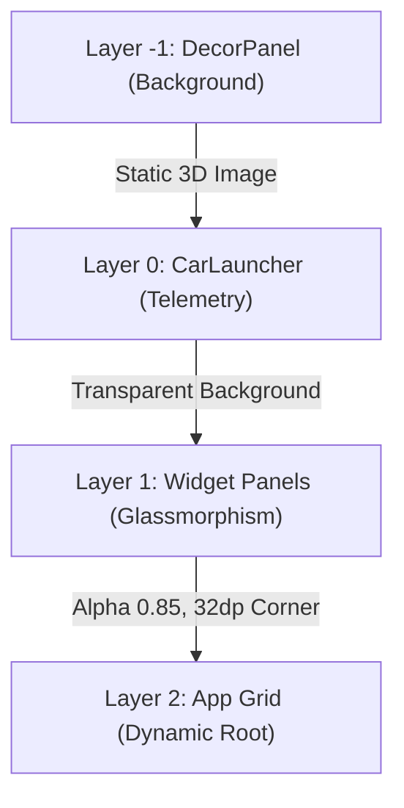

# Scalable UI in Android Automotive OS

This repository contains the architecture definitions and Runtime Resource Overlay (RRO) for deploying a next-generation "Glassmorphism" UI on top of Android Automotive OS (AAOS) via **System Window Orchestration**.

## Core Architectural Shift

Traditionally, AAOS applications relied on **UI Embedding** using `ActivityView` and `TaskView` inside the `CarLauncher` code. This method was extremely memory-heavy because every widget was technically running an isolated Android window hierarchy within another process.

This architecture transitions completely to **System Window Orchestration** using the AOSP `car-scalableui-lib`. Instead of embedding tasks, the framework delegates the spatial bounding, Z-ordering, and state transitions of actual Android Tasks directly to the WindowManager. This dramatically improves performance, decoupling the Launcher from the application layout entirely.

## Z-Order Hierarchy & Glassmorphism

This repository injects a 4-Layer spatial orchestration model utilizing AOSP's internal Declarative XML State Machine (`Transitions`).

### 1. DecorPanels (The Wallpaper)
`scalable_panel_decor_bg.xml` uses a `DecorPanel` bound to `Layer -1`. This panel does not run an Activity; it natively inflates `@layout/bg_car_model`, pinning a static, high-resolution 3D car interior model permanently behind the dashboard UI.

### 2. Transparent CarLauncher
`CarLauncher` is mapped to `Layer 0`. By explicitly declaring its window background as transparent (`@android:color/transparent`), its telemetry data and status icons float above the DecorPanel.

### 3. Glassmorphism Panels
The widgets (Media, Dialer, Settings) are mapped to `Layer 1`. Their spatial bounds are strictly enforced to avoid overlapping system bars. By setting `<Alpha alpha="0.85"/>` and `<Corner radius="32dp"/>`, they render as frosted-glass cards, seamlessly blending the application content with the cinematic background.

### 4. Dynamic Launch Root
`scalable_panel_app.xml` is defined as the "Launch Root" (`role="DEFAULT"`) at `Layer 2`. All non-explicitly mapped apps (e.g., Maps, Chrome, App Drawer) natively route into this panel. When triggered, it slides gracefully over the widgets using an `accelerate_decelerate_interpolator`. When the Home intent is fired, it collapses (`Visibility isVisible="false"`), revealing the underlying Glassmorphism dashboard.

## Deployment

To deploy this architecture, the `CarSystemUIScalableUIOverlay` RRO is provided. Include this module in your `.repo/local_manifests` or `PRODUCT_PACKAGES` to override the default `com.android.systemui` configurations without modifying the core AOSP Java codebase.
