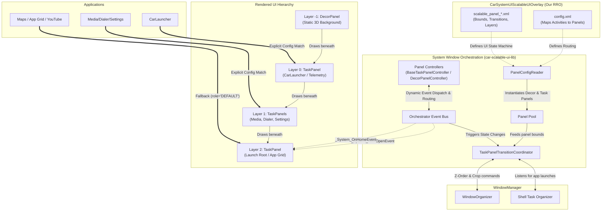
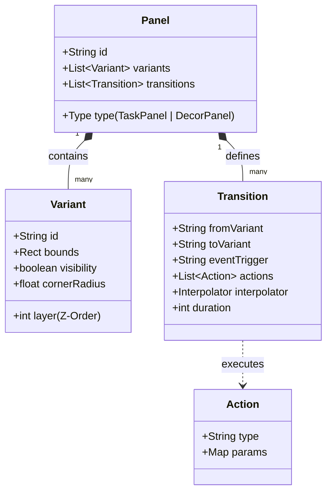
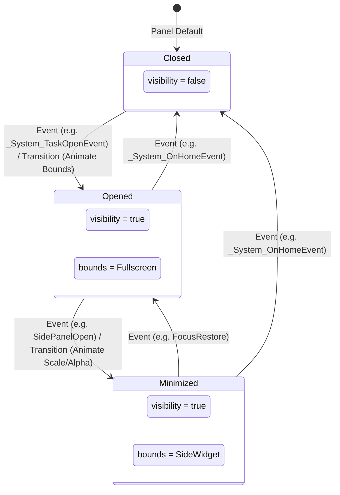

# Scalable UI in Android Automotive OS

This repository contains the architecture definitions and Runtime Resource Overlay (RRO) for deploying a next-generation "Glassmorphism" UI on top of Android Automotive OS (AAOS) via **System Window Orchestration**.

## Core Architectural Shift

Traditionally, AAOS applications relied on **UI Embedding** using `ActivityView` and `TaskView` inside the `CarLauncher` code. This method was extremely memory-heavy because every widget was technically running an isolated Android window hierarchy within another process.

This architecture transitions completely to **System Window Orchestration** using the AOSP `car-scalableui-lib`. Instead of embedding tasks, the framework delegates the spatial bounding, Z-ordering, and state transitions of actual Android Tasks directly to the WindowManager. This dramatically improves performance, decoupling the Launcher from the application layout entirely.

## Detailed Architecture & Data Flow

The following diagram details how the AOSP WindowManager Shell interacts with the System Window Orchestrator, and how our custom RRO and code-level controllers drive the spatial orchestration without modifying core Java code.



## The XML Declarative Model

Scalable UI abstracts custom windowing logic into a high-level, config-driven XML model composed of the following core building blocks:



* **Panels**: The fundamental rectangular containers. 
  * `TaskPanel`: Hosts actual application activity tasks running in separate processes.
  * `DecorPanel`: Hosts view-based layouts (widgets, climate overlays) running in the System UI process (lower overhead).
* **Variants**: Define specific visual states (bounds, visibility, Z-order layers, alpha, corner radius) for each panel.
* **Transitions**: Define animation paths (duration, interpolators) to move a panel from a `fromVariant` to a `toVariant` when triggered by an Event.

### Panel Transition Lifecycle & State Machine



---

## Component Breakdown

#### 1. PanelConfigReader (PCR)
The `PanelConfigReader` parses the RRO's `window_states` array in `config.xml`. It reads our custom `scalable_panel_*.xml` files and dynamically instantiates either a `DecorPanel` or a `TaskPanel`. 

#### 2. TaskPanelTransitionCoordinator (TPTC)
The heart of the orchestrator. It receives bounds (`left`, `top`, `bottom`, `right`), Alpha, and Corner radius from our XML files. It then communicates directly with the AOSP `WindowOrganizer` to apply physical crops and Z-order translations to the raw window surfaces.

#### 3. Panel Controllers
OEMs can extend XML configurations using Java/Kotlin classes extending `BaseTaskPanelController` or `DecorPanelControllerBase`. These hook into System UI's Dagger dependency injection graph to implement dynamic routing logic (e.g., launching fallback apps) and dispatch custom events to the event bus.

#### 4. State Machine & Event Bus
The `<Transitions>` defined in our XML files are hooked into the `Orchestrator Event Bus`. 
- When an app opens, `_System_TaskOpenEvent` fires, and the TPTC smoothly translates the `app_panel` (Layer 2) from `isVisible="false"` to `true` using our defined `accelerate_decelerate_interpolator`.
- When the user taps the Home button, `_System_OnHomeEvent` fires, instantly transitioning the `app_panel` out of view to reveal the Glassmorphism widgets underneath.

---

## Integration Requirements

Deploying Scalable UI requires configuring three critical parameters within AOSP overlays:

1. **Framework Insets (Framework RRO):**
   Set `config_remoteInsetsControllerControlsSystemBars` to `true` so the WindowManager Shell can direct window boundaries.
2. **Orchestrator Enablement (System UI RRO):**
   Set `config_enableScalableUI` to `true` and register custom XML layouts under the `<array name="window_states">` parameter.
3. **Stub Launcher Bypass:**
   Replace the default `CarLauncher` package with **`StubCarLauncher`**. Since task bounds and orchestration are managed by System UI, the traditional launcher activity is reduced to a blank, non-rendering component that simply reports system readiness.

---

## Configuration Variables Reference

To successfully overlay and customize the orchestrator via a Runtime Resource Overlay (RRO), configure the following variables in System UI's `res/values/config.xml` (or the framework's core overlays):

### 1. Framework-Level Core Options
* **`config_remoteInsetsControllerControlsSystemBars`** (`bool`, default: `false`)
  * **Scope:** Android Framework (`frameworks/base/core/res/res/values/config.xml`)
  * **Description:** If set to `true`, delegates system bar inset control to the WindowManager Shell remote insets controller. Required for the orchestrator to dynamically control system bar layout bounding.

### 2. System UI Core Variables
* **`config_enableScalableUI`** (`bool`, default: `false`)
  * **Scope:** System UI (`com.android.systemui`)
  * **Description:** The primary switch to toggle the Scalable UI window orchestration core. When `true`, it activates the `car-scalable-ui-lib` coordinators.
* **`config_enableClearBackStack`** (`bool`, default: `false`)
  * **Scope:** System UI (`com.android.systemui`)
  * **Description:** Determines whether the back stack of hosted tasks is completely cleared when transitioning a TaskPanel out of view (e.g., when the home button is pressed).
* **`config_enableSafeAreaAndToolbarPerDisplay`** (`bool`, default: `false`)
  * **Scope:** System UI (`com.android.systemui`)
  * **Description:** When enabled, allows safe-area paddings and System Bar toolbars to be calculated and applied independently per physical display in multi-display topologies.
* **`config_systemBarSuwBehavior`** (`integer`, default: `0`)
  * **Scope:** System UI (`com.android.systemui`)
  * **Description:** Defines how the System Bar behaves during the Setup Wizard (SUW) flow (e.g., hidden, locked, or partially interactive).

### 3. Layout Orchestration & Routing
* **`window_states`** (`array` of xml resources)
  * **Scope:** System UI (`com.android.systemui`)
  * **Description:** An ordered list of references to custom panel XML layouts (e.g., `@xml/media_panel`, `@xml/map_panel`). Each item defines a panel’s bounds, layers, variants, and transition state machine.
* **`config_default_activities`** (`string-array`)
  * **Scope:** System UI (`com.android.systemui`)
  * **Description:** Maps panel IDs directly to target Activity components or layout resource templates to automatically spawn them at startup.
  * **Format:** `panel_id;package/activity_class` or `panel_id;@layout/layout_resource_name`
  * **Example:**
    ```xml
    <string-array name="config_default_activities" translatable="false">
        <item>map_panel;com.android.car.mapsplaceholder/com.android.car.mapsplaceholder.MapsPlaceholderActivity</item>
        <item>media_panel;com.android.car.carlauncher/com.android.car.carlauncher.ControlBarActivity</item>
        <item>phone_shadow;@layout/phone_shadow_view</item>
    </string-array>
    ```
* **`system_bar_app_drawer_intent`** (`string`)
  * **Scope:** System UI (`com.android.systemui`)
  * **Description:** Specifies the explicit Android Intent URI fired when the user interacts with the app drawer launcher button on the system bar.

---

## Architectural Trade-offs & Limitations

* **System UI Single Point of Failure (SPOF):** Because task surfaces are orchestrated directly by System UI components (`car-scalable-ui-lib`), any crash in the `com.android.systemui` process will immediately terminate all hosted activities inside active TaskPanels.
* **State Persistence Loss:** On System UI restarts or process crashes, the orchestrator loses the state machine's active variants. Panels automatically revert to their default base variants upon restart, causing active user views to reset.
* **BLAST Buffer Queue Syncing:** In rare conditions with rapid resizing transitions, the underlying window surfaces might experience frame mismatch or brief flickering due to synchronizing constraints between `BLASTBufferQueue` and the orchestrator's crop commands.

---

## Deployment

To deploy this architecture, the `CarSystemUIScalableUIOverlay` RRO is provided. Include this module in your `.repo/local_manifests` or `PRODUCT_PACKAGES` to override the default `com.android.systemui` configurations without modifying the core AOSP Java codebase.
