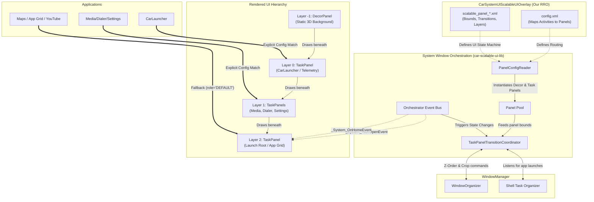

# Scalable UI in Android Automotive OS

This repository contains the architecture definitions and Runtime Resource Overlay (RRO) for deploying a next-generation "Glassmorphism" UI on top of Android Automotive OS (AAOS) via **System Window Orchestration**.

## Core Architectural Shift

Traditionally, AAOS applications relied on **UI Embedding** using `ActivityView` and `TaskView` inside the `CarLauncher` code. This method was extremely memory-heavy because every widget was technically running an isolated Android window hierarchy within another process.

This architecture transitions completely to **System Window Orchestration** using the AOSP `car-scalableui-lib`. Instead of embedding tasks, the framework delegates the spatial bounding, Z-ordering, and state transitions of actual Android Tasks directly to the WindowManager. This dramatically improves performance, decoupling the Launcher from the application layout entirely.

## Detailed Architecture & Data Flow

The following diagram details how the AOSP WindowManager Shell interacts with the System Window Orchestrator, and how our custom RRO drives the spatial orchestration without modifying core Java code.

### Component Breakdown

#### 1. PanelConfigReader (PCR)
The `PanelConfigReader` parses the RRO's `window_states` array in `config.xml`. It reads our custom `scalable_panel_*.xml` files and dynamically instantiates either a `DecorPanel` (for static backgrounds) or a `TaskPanel` (for hosting Android Activities). 

#### 2. TaskPanelTransitionCoordinator (TPTC)
This is the heart of the orchestrator. It receives bounds (`left`, `top`, `bottom`, `right`), Alpha, and Corner radius from our XML files. It then communicates directly with the AOSP `WindowOrganizer` to apply physical crops and Z-order translations to the raw window surfaces. This creates the "Glassmorphism" effect without the apps knowing they are being cropped.

#### 3. State Machine & Event Bus
The `<Transitions>` defined in our XML files are hooked into the `Orchestrator Event Bus`. 
- When an app opens, `_System_TaskOpenEvent` fires, and the TPTC smoothly translates the `app_panel` (Layer 2) from `isVisible="false"` to `true` using our defined `accelerate_decelerate_interpolator`.
- When the user taps the Home button, `_System_OnHomeEvent` fires, instantly transitioning the `app_panel` out of view to reveal the Glassmorphism widgets underneath.

#### 4. DecorPanels vs TaskPanels
- **DecorPanel**: Inflates a static Android XML `@layout` (like our 3D cinematic wallpaper) directly into the orchestrator surface. It consumes almost zero memory because it has no Activity lifecycle.
- **TaskPanel**: Acts as a `RootTaskDisplayArea` bucket. When the `Shell Task Organizer` reports that `CarLauncher` has launched, the orchestrator catches it and drops its window surface into the `home_panel` bucket.

## Deployment

To deploy this architecture, the `CarSystemUIScalableUIOverlay` RRO is provided. Include this module in your `.repo/local_manifests` or `PRODUCT_PACKAGES` to override the default `com.android.systemui` configurations without modifying the core AOSP Java codebase.
