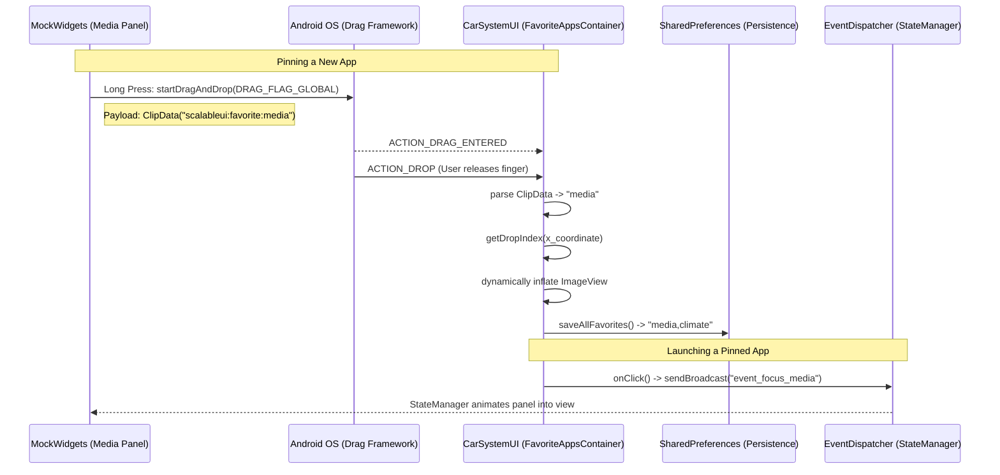

# Favorite Apps Architecture

The Favorite Apps feature is designed as a **cross-process** orchestration system. Because the System Bar is owned by `CarSystemUI` and the widgets are owned by separate apps (like `MockWidgets`), they cannot share memory directly. Here is a breakdown of how they communicate.

## Architecture Diagram

## How It Works

### 1. Cross-Process Drag & Drop
When you long-press the album art in the media widget, the app calls `startDragAndDrop()` with a critical flag: `View.DRAG_FLAG_GLOBAL`. 
This tells the Android OS to allow the drag shadow to cross window boundaries. The app attaches a small text payload called `ClipData` containing the string `"scalableui:favorite:media"`.

### 2. System UI Drop Target
The `FavoriteAppsContainer` inside `CarSystemUI` has an `OnDragListener`. It continuously listens for drop events on the system bar. When you release your finger, it intercepts the `ClipData`.
It reads `"scalableui:favorite:media"`, strips out the prefix, and knows it needs to generate an icon for `"media"`. 

### 3. Persistence (No Database Needed)
**Do we use a database?** No. For simple, ordered lists, an SQLite database is overkill and slower. 
Instead, we use Android's **`SharedPreferences`**. 
When an app is dropped (or reordered), the container loops through the icons from left to right, builds a comma-separated string (e.g., `"media,climate,maps"`), and saves it to a local XML file inside SystemUI's secure storage. When the car reboots, SystemUI reads this string and instantly recreates the icons.

### 4. Integration with Launcher / Orchestrator
When you click a pinned icon on the system bar, `CarSystemUI` doesn't actually launch the app directly. Instead, it fires a global broadcast:
`com.android.systemui.car.wm.scalableui.TRIGGER_EVENT` with the extra `event_focus_media`.

The Scalable UI `StateManager` (running in the background) intercepts this broadcast and fluidly animates the Media panel into focus!
